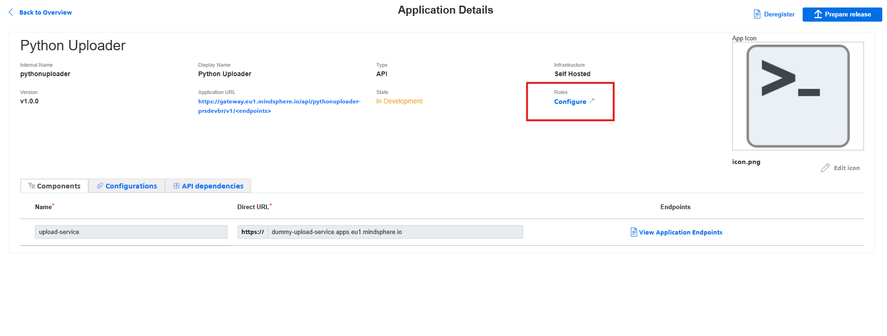

# 📡 Inserção de dados no Insights Hub via Postman  

Bem-vindo! 👋  

Este repositório reúne **exemplos práticos** e **tutoriais** para enviar dados de séries temporais (*time series*) ao **Insights Hub** utilizando o **Postman**.  

O objetivo é **facilitar a integração** de sensores simulados, aplicações e scripts com a plataforma, ajudando desenvolvedores e equipes a **testar rapidamente fluxos de ingestão de dados**.  

---

## 📂 O que você vai encontrar aqui  

- ✅ Exemplos prontos de **JSON** para envio de dados  
- ✅ Explicações sobre **autenticação e headers necessários**  
- ✅ Boas práticas para estruturar **assets, aspects e propriedades**  
- ✅ Passo a passo para visualizar os dados no **Monitor do Insights Hub**  

Este guia foi criado para ser **simples e direto**, servindo tanto para iniciantes quanto para quem já tem experiência com a plataforma e deseja acelerar a prototipagem de integrações.  

---

## 🎯 Primeiro objetivo  

**Obter as credenciais de acesso para autenticação via API, utilizando o Developer Cockpit.**  

### 🔑 Passos  

1. Acesse o **Launchpad do Insights Hub** (necessário possuir acesso ao Developer Cockpit).  
2. Vá em **Settings → Applications**.  
3. Clique em **Create App**.  
4. Preencha as informações básicas (nome, descrição etc.) e clique em **Role Configure**.  

  

5. Após salvar, vá até **App Credentials**, gere um novo acesso clicando em **Issue access**.  
6. Copie os dados gerados de **Client ID** e **Client Secret**.  
7. Clique em **Download App Credentials Postman Collection with Examples**.  
   > ⚠️ **Atenção:** Guarde essas informações em local seguro. Você **não poderá visualizá-las novamente**.  

  

---

## 📥 Inserindo dados no Postman  

### Importando a Collection  
- Na tela inicial do **Postman**, selecione **Import** e carregue o arquivo da Postman Collection.  
- Em seguida, selecione a opção **Generate App Credential** para gerar o **Access Token**.  
- Copie o **Token**.  

  

---

## 🔎 Obtendo o Asset ID  

- O próximo passo é copiar o **assetId** do Asset para o qual iremos enviar os dados.  
- Você pode visualizá-lo diretamente na **URL do navegador**:  

  

- Ou, se preferir, pode utilizar a chamada **Get assets of existing tenant**:  

  

---

## 🚀 Enviando dados  

Com as informações em mãos, podemos realizar o **PUT** de dados para o asset desejado.  

- Após o `assetId`, é necessário colocar o `aspectName` utilizado naquele asset.  

**Exemplo de endpoint:**  
PUT https://gateway.eu1.mindsphere.io/api/iottimeseries/v3/timeseries/{assetId}/{aspectName}

  

---

### Configuração de Autenticação  

- Vá até a aba **Authorization** no Postman.  
- Selecione **Bearer Token**.  
- Cole o **Token** previamente gerado.  

  

---

### Método 1 – Envio de JSON manual (raw)  

- Vá até a aba **Body → raw** e cole o JSON diretamente.  
- Use sempre o formato ISO 8601 para timestamp:  
**aaaa-mm-dd"T"hh:mm:ss"Z"**
  
  

Após o envio:  
- Os dados ficam gravados no **asset selecionado**.  
- Eles podem ser acompanhados diretamente no **Monitor do Insights Hub**.  

  

---

### Método 2 – Envio via arquivo JSON (binary)  

- Vá até a aba **Body → binary**.  
- Selecione o **arquivo JSON** a ser enviado.  

  

---

✨ Pronto! Agora você já consegue inserir e visualizar dados no **Insights Hub** usando o **Postman**.  

